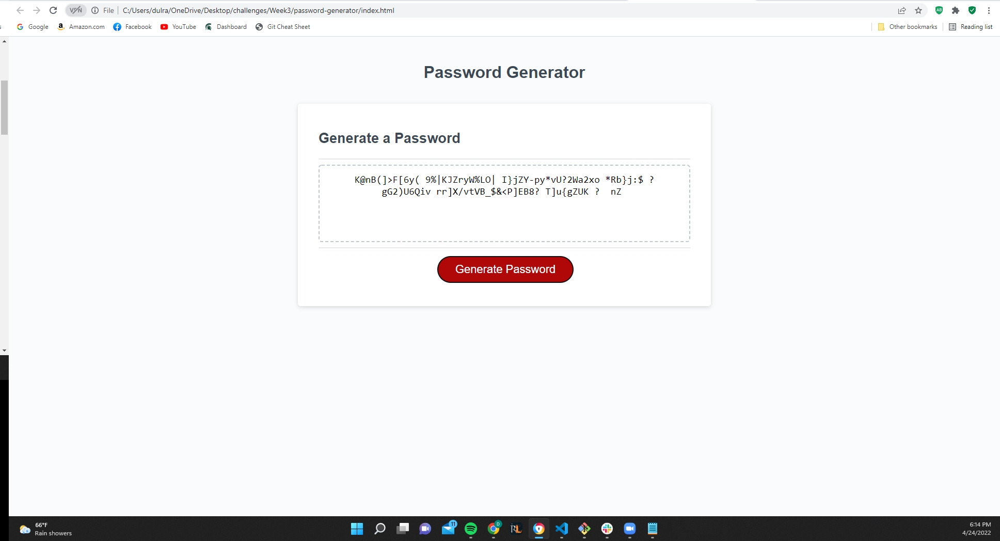

# password-generator

## Description

For this project the goal was to write code in Javascript to randomly create a password from selected parameters. The parameters needed to be selected by the user and pop up via a confirm window, after the parameters were chosen then the script would return a completely random password that included the selected parameters.

i had quite a bit of trouble with this, and ended up depending on google quite a bit to try and shine some light on ways to go about this. i made variables that used a confirm action, then was able to reference those by assigning those variables to another variable so that i could test whether they were returned true or false. if they came back as true the array was added to a new array that could be accessed by another for loop to choose the characters at random. if they returned false then the array was left out of the array that is used to create the password.

in the end i chose to unicode 'dec' to return characters instead of writing every character out seperately, and used a for loop for return all the characters in an array that i could call upon within another function.

Thanks to google, i have a working prototype that i wouldnt consider perfect as there were some bugs that i wasnt able to figure out on my own, but the script does work and will return a randomly generated password that is created under specified conditions.

## Links to Project

Repo: (https://github.com/dulrath12/password-generator)

Page:(https://dulrath12.github.io/password-generator/)